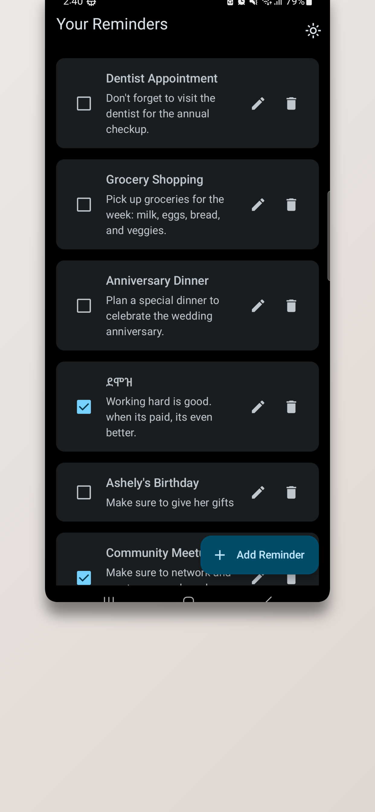

# Reminder App

This is a simple reminder app that allows users to create and display reminders directly on their home screen using a widget. The reminders are persistent and can be updated periodically through background tasks. Built with a modern Android development stack, the app follows the MVVM (Model-View-ViewModel) architecture, ensuring a clean separation of concerns and easy maintenance.

## Features
- **Home Screen Widget**: Display your reminders directly on the home screen for quick access.
- **Background Syncing**: Periodically updates the reminder text using WorkManager.
- **Persistent Reminders**: Reminders stay on the home screen even after the app is closed.
- **MVVM Architecture**: Ensures a structured and maintainable codebase.

## Technologies Used
- **Kotlin**: The programming language used for the app.
- **Jetpack Compose**: Used for building the app's UI in a declarative manner.
- **Koin**: Dependency injection for managing the app's components.
- **Glance**: Used for creating the app widget that displays the reminder on the home screen.
- **WorkManager**: Manages background tasks to update reminders periodically.

## Screenshots

| Preview 1 | Preview 2 | Preview 3 | Preview 4 |
|-----------|-----------|-----------|-----------|
|  |  |  |  |

## How It Works
1. **Create Reminder**: Users can create and set reminders from within the app.
2. **Home Screen Widget**: The reminder is displayed on the home screen via a widget powered by the Glance library.
3. **Background Update**: WorkManager schedules background tasks to update the widget periodically.

## Architecture
The app follows the MVVM architecture, separating the responsibilities into:
- **Model**: Represents the data and business logic.
- **View**: The UI layer built with Jetpack Compose.
- **ViewModel**: Bridges the View and Model layers, holding the app's state and handling the business logic.
